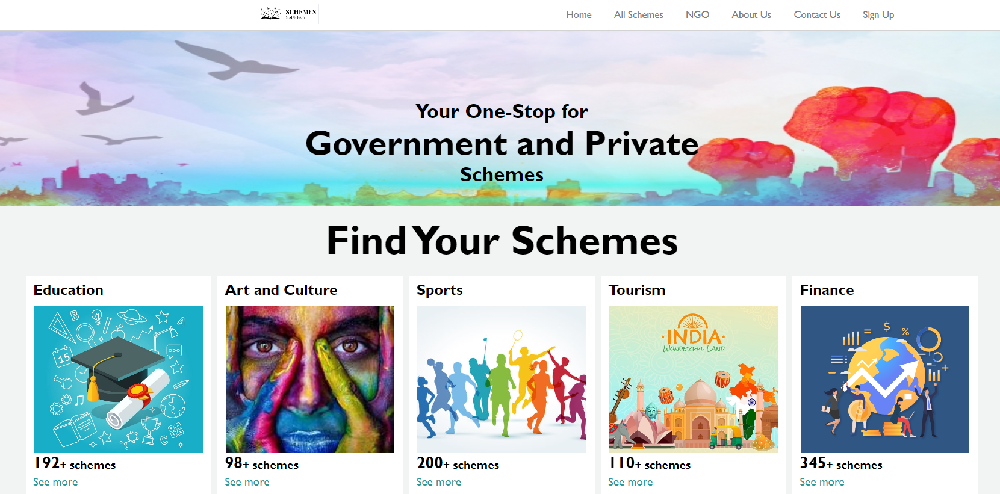

# Universal Scheme Solutions Platform

Welcome to the Universal Scheme Solutions Platform! This web application consolidates government and private schemes into one platform, offering users easy access to a variety of schemes across more than 10 categories, including education, health, technology, and food safety.



## Table of Contents
- [Features](#features)
- [Prerequisites](#prerequisites)
- [Installation](#installation)
- [Running the Application](#running-the-application)
- [Usage](#usage)
- [Technology Stack](#technology-stack)

## Features

- **Consolidated Information**: Access a wide range of schemes from government and private entities in one place.
- **Diverse Categories**: Explore schemes in more than 10 categories such as:
  - Education
  - Health and Wellness
  - Innovation & Technology
  - Startup
  - Food and Agriculture
  - Law and Justice
  - Finance
  - Women and child
  - International Affairs
  - Art and Culture
  - Tourism
  - Sports
- **Streamlined Search**: Simplified search functionality to help users find schemes quickly.
- **NGO Connections**: Direct connections to NGOs for additional support and resources.

## Prerequisites

Before you begin, ensure you have met the following requirements:
- **Node.js**: Install Node.js from [nodejs.org](https://nodejs.org/)
- **npm**: Node package manager comes with Node.js, check if it's installed by running:
    ```bash
    npm -v
    ```
- **Git**: Install Git from [git-scm.com](https://git-scm.com/)

## Installation

To install the Universal Scheme Solutions Platform, follow these steps:

1. **Clone the Repository**:
    ```bash
    https://github.com/Etika8445/Universal-Scheme-Solutions-Platform.git
    ```
2. **Navigate to the Project Directory**:
    ```bash
    cd universal-scheme-solutions
    ```
3. **Install Dependencies**:
    ```bash
    npm install
    ```

## Running the Application

To start the application, run the following command:

```bash
npm start
```
Visit `http://localhost:3000` in your web browser to view the application.

## Usage

Once the application is running, you can use it to:

- Browse through various categories of schemes.
- Use the search functionality to find specific schemes.
- Connect with NGOs for further support.

## Technology Stack

The Universal Scheme Solutions Platform is built using the following technologies:

- **Frontend**: React.js
- **Backend**: Node.js, Express.js
- **Database**: MongoDB
- **Styling**: Bootstrap, CSS
- **Version Control**: Git

